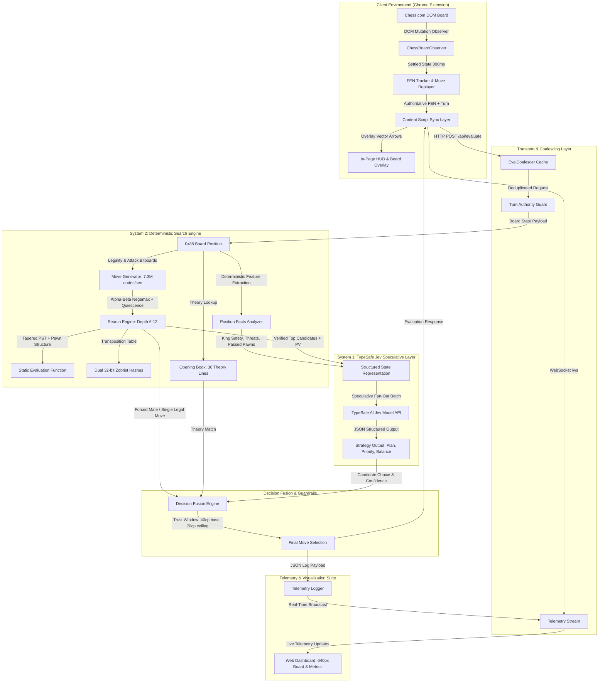

# Experimental Study: Non-Autoregressive Decision Architecture in Strategic Chess using TypeSafe AI Jev

## 1. Abstract and Experimental Overview

This project is an empirical investigation into hybrid decision architectures for strategic game environments. It explores the integration of **TypeSafe AI Jev** (a non-autoregressive System 1 model) with a high-performance deterministic chess search engine (System 2) operating in a live browser environment.

### Experimental Objective
Standard autoregressive language models struggle with deterministic board games due to tactical blindness, horizon effects, and illegal move hallucinations. The objective of this experiment is to determine whether non-autoregressive speculative models can provide macro-strategic intent and positional candidate selection when strictly bounded by a deterministic verification engine.

### Core Result
Across multiple iteration cycles, the fused hybrid architecture achieved consistent tactical stability and defeated Chess.com engine bots rated up to **1825 ELO**. The system eliminated move hallucinations, prevented tactical blunders, and successfully executed coordinated king hunts, passed pawn promotions, and endgame conversions.

---

## 2. Live Demonstration

The demonstration video below records real-time board tracking, speculative decision generation, in-page direction overlay rendering, and telemetry streaming during active play on Chess.com.

https://github.com/user-attachments/assets/chess-with-jev.mp4

<video src="./chess with jev.mp4" controls width="100%"></video>

[Download or View Demonstration Video](./chess with jev.mp4)

---

## 3. System Architecture and Data Flow

The architecture decouples strategic judgment from tactical calculation:
1. **System 2 (Deterministic)**: Decides tactical safety, legal move generation, evaluation, and forced checkmates.
2. **System 1 (Jev Model)**: Evaluates high-level strategic priorities, positional balances, and selects candidate moves from verified shortlists.
3. **Decision Fusion Engine**: Owns the final move selection using a dynamic trust window and strict blunder ceilings.



---

## 4. Empirical Hypotheses and Iterative Findings

| Iteration | Architecture Configuration | Observed Behavioral Flaws | Measured Outcome |
| :--- | :--- | :--- | :--- |
| **Iteration 1** | Unguided Model Generation (Jev prompted with all legal moves) | Move hallucinations, passive back-rank piece shuffling, loss of material, lack of tactical horizon. | Failed against 1000 ELO bots due to single-ply blunders. |
| **Iteration 2** | Filtered Heuristics + Rigid Rules (Hardcoded penalties for piece retreat) | Inflexible responses, conflicting rule weights, unable to transition smoothly from opening to endgame. | Peaked around 1350 ELO, brittle edge-case behavior. |
| **Iteration 3** | Dual-System Fusion (0x88 Alpha-Beta Search + Speculative Jev Fan-Out + Trust Window) | Zero hallucinations, robust checkmate conversion, active king attacks, solid opening repertoire. | **Defeated 1825 ELO Chess.com bot consistently.** |

### Key Experimental Discoveries
1. **Speculative Fan-Out Over Verified Candidates**: Providing the model with a verified shortlist of 3 to 5 engine-evaluated moves (with exact evaluations and expected principal variations) completely eliminates illegal move attempts and hallucinations.
2. **Dynamic Trust Window Scaling**: Allowing the model to deviate from the engine best move by up to 40 centipawns (scaled by model confidence), with an absolute blunder ceiling of 70 centipawns, allows creative strategic play while guaranteeing tactical soundness.
3. **Turn Authority and Deduplication**: Board observation settling (300 ms) and request coalescing prevent race conditions, rapid request flapping, and turn confusion during fast tactical sequences.

---

## 5. Technical Component Breakdown

### System 2: Deterministic Engine (`server/src/engine/`)
- **0x88 Representation**: Compact board layout supporting fast square validation, attack detection, and boundary checks.
- **Move Generation**: Generates 7.3 million nodes per second, achieving depth 6 to 12 in under 600 ms.
- **Tapered Evaluation**: Dynamic interpolation between opening and endgame tables based on non-pawn material phase.
- **Alpha-Beta Search**: Negamax with iterative deepening, quiescence search, null-move pruning, late move reductions, and dual Zobrist transposition caching.

### System 1: Strategic Brain (`server/src/brain/`)
- **Structured Facts Extraction**: Computes king exposure, pawn shield integrity, open files, passed pawn promotion distance, and undefended loose pieces.
- **Batched Speculative Questions**: Submits independent typed queries to the Jev model:
  - `planChoice`: Candidate selection over engine-verified shortlist.
  - `strategicPriority`: Focus classification (`king_hunt`, `promote_passed_pawn`, `defend_threat`, `mobilize_arsenal`, `development`).
  - `positionBalance`: Normalized continuous evaluation score.
  - `opponentThreat` and `attackAvailable`: Tactical danger probabilities.
- **Circuit Breaker**: Detects upstream API timeouts or failures and falls back instantly to local engine evaluation without latency degradation.

### Extension & Telemetry (`src/` and `server/public/`)
- **DOM Scanner & Observer**: Robust DOM mutation observer that isolates Chess.com board updates from extension UI modifications.
- **In-Page Overlay**: Minimalist 2.8px vector arrow overlay and square highlight indicator.
- **Real-Time Telemetry Suite**: Pure OLED black minimal dashboard featuring a 640px visual chessboard, live 2x2 metric matrix, strategic thinking breakdown, and full interactive move history.

---

## 6. Installation and Reproduction Guide

### Prerequisites
- Node.js (v18.0.0 or higher)
- npm or pnpm
- Google Chrome or Chromium-based browser
- TypeSafe AI API Key (optional for local engine fallback, required for Jev System 1)

### 1. Repository Setup
```bash
git clone https://github.com/Deepender25/chess-with-jev.git
cd chess-with-jev
npm install
cd server && npm install && cd ..
```

### 2. Environment Configuration
Create `.env` in both the root and `server/` directory:
```bash
cp server/.env.example server/.env
```
Edit `server/.env` with your TypeSafe API credentials:
```env
TYPESAFE_API_KEY=your_typesafe_api_key_here
PORT=8765
HOST=0.0.0.0
JEV_MODEL=jev-latest
DEBUG_JEV=true
```

### 3. Start Local Engine Backend
```bash
npm run server
```
The backend server and telemetry dashboard will initialize on `http://localhost:8765`.

### 4. Build and Load Chrome Extension
```bash
npm run build
```
1. Open Google Chrome and navigate to `chrome://extensions/`.
2. Enable **Developer mode** in the top-right corner.
3. Click **Load unpacked** and select the `dist/` directory in this repository.
4. Navigate to [Chess.com](https://www.chess.com/play/computer) to begin an evaluation session.

---

## 7. Verification and Test Suite

The system includes test suites covering move generation, FEN tracking, turn authority guards, and engine endpoints:

```bash
# Run Chrome extension unit tests (38 tests)
npm test

# Run backend engine & decision pipeline tests (46 tests)
npm run server:test
```

---

## 8. License

This research experiment is distributed under the MIT License. See `LICENSE` for details.
